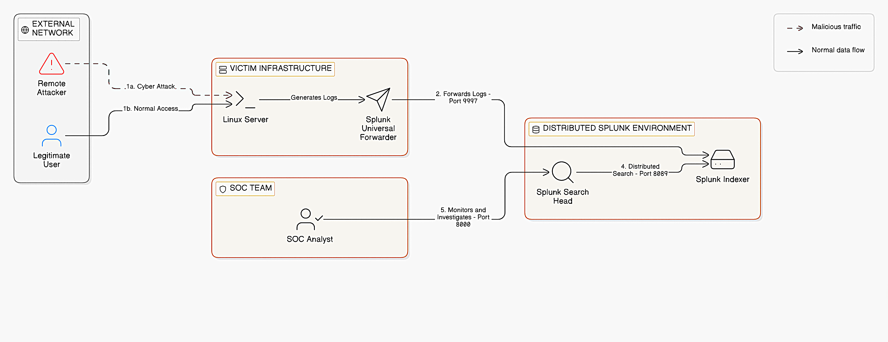

# 🔐 SSH Log Analysis & Threat Detection Dashboard

---

## 📌 Overview

This project demonstrates SOC-level security monitoring using Splunk by analyzing SSH authentication logs. The objective is to detect suspicious login activity such as brute-force attacks, unauthorized access attempts, and abnormal connection patterns.

---

## 🏗️ Real-World Production Architecture



```
Remote Clients (Attackers/Users)
        │  SSH login attempts (Port 22)
        ▼
Linux Server  →  sshd generates /var/log/auth.log
        │
        ▼
Splunk Universal Forwarder  →  forwards raw logs
        │
        ▼
Splunk Indexer  →  stores, parses, indexes events
        │
        ▼
Splunk Search Head  →  runs SPL (cron: */15 * * * *)
        │  count > 5 → ALERT
        ▼
SOC Analyst  →  monitors dashboard → blocks IP / files incident
```

---

## 📂 Structure

```
splunk-ssh-analysis/
├── README.md
├── assets/pipeline_diagram.png
├── Task1-Log-Ingestion/
├── Task2-Failed-Login-Analysis/
├── Task3-Brute-Force-Detection/
├── Task4-Successful-Login-Dashboard/
└── Task5-Unauthenticated-Connections/
```

---

## 🎯 Task Summary

| Task | Objective | Key Finding |
|------|-----------|-------------|
| [Task 1](Task1-Log-Ingestion/README.md) | Ingest & parse SSH logs | 3600 events, 4 event types confirmed |
| [Task 2](Task2-Failed-Login-Analysis/README.md) | Analyze failed logins | 915 events from 50 unique IPs |
| [Task 3](Task3-Brute-Force-Detection/README.md) | Detect brute-force & configure alert | Alert fired 3× at 15-min intervals |
| [Task 4](Task4-Successful-Login-Dashboard/README.md) | Track successful logins | 918 logins; dashboard created |
| [Task 5](Task5-Unauthenticated-Connections/README.md) | Spot unauthenticated connections | 858 probes in 13ms — automated scanning confirmed |

---

## 🔑 Key Findings

- **Brute-Force:** 909 events from 58 IPs; top attacker `10.0.0.28` made 15 attempts against `10.0.1.1`
- **Port Scanning:** 858 unauthenticated connections in a **13ms window** — confirmed automated tooling
- **Failed Logins:** 915 events spread evenly across 50 IPs — distributed/botnet attack pattern
- **Alert Verified:** Fired 3 times (17:15 → 17:30 → 17:45 IST) confirming end-to-end detection pipeline

---

## 🛠️ Lab Setup

#### [<u>*Install Splunk Enterprise*<u>](https://www.splunk.com/en_us/download/splunk-enterprise.html?utm_campaign=bing_ind_en_search_brand&utm_source=bing&utm_medium=cpc&utm_content=Splunk_Enterprise_Demo&utm_term=splunk%20enterprise&_bk=splunk%20enterprise&_bt=&_bm=e&_bn=o&_bg=1150090942143964&device=c&msclkid=fe0a13bf2c43160e58057a137e8aa81e)
#### [<u>*Installation and Setup Video*<u>](https://youtu.be/E3Rofa1A6YM?si=I1zyJr92u9hwNpPU)

