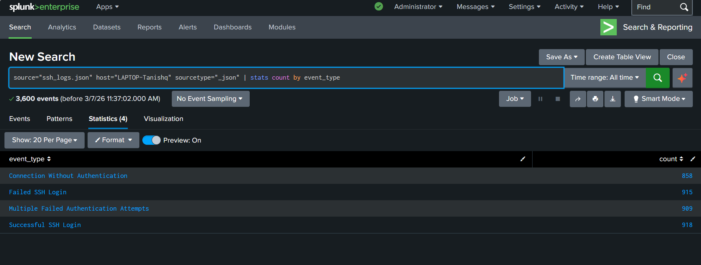

# Task 1 — Log Ingestion & Parsing

## 🎯 Objective
Upload the SSH log file into Splunk and confirm all fields and event types are correctly extracted.

---

## 📋 Steps

1. Go to **Apps → Search & Reporting → Add Data → Upload**
2. Select `ssh_logs.json`, set **sourcetype = `_json`**
3. Set host = `LAPTOP-Tanishq`, click **Review → Submit → Start Searching**

### Fields Extracted

| Field | Description |
|-------|-------------|
| `event_type` | SSH event category (4 types) |
| `auth_success` | `true` / `false` / `null` |
| `auth_attempts` | Number of login attempts |
| `id.orig_h` | Source IP |
| `id.resp_h` | Destination host |
| `ts` | Event timestamp |

---

## 🔍 Validation Query

```spl
source="ssh_logs.json" host="LAPTOP-Tanishq" sourcetype="_json"
| stats count by event_type
```

---

## 📊 Results

| event_type | count |
|------------|-------|
| Connection Without Authentication | 858 |
| Failed SSH Login | 915 |
| Multiple Failed Authentication Attempts | 909 |
| Successful SSH Login | 918 |
| **Total** | **3,600** |

---

## 🖼️ Screenshots

### `Task_1-Splunk_Dashboard.png`


Raw events view after upload — shows 3,600 ingested events, the event timeline bar, and an expanded event with all extracted fields visible (`auth_attempts`, `auth_success`, `event_type`, `id.orig_h`, `id.resp_h`, `ts`, etc.).

---

### `Task_1-_Validation_Search.png`


Statistics tab output of the validation query — all 4 event types present with balanced counts (858–918 per type), confirming correct ingestion.
