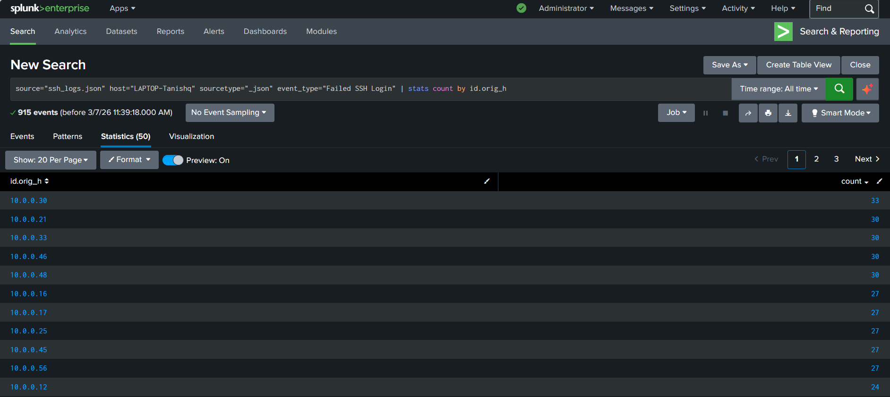
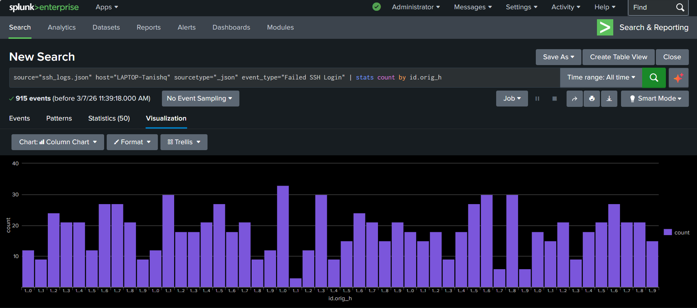

# Task 2 — Failed Login Attempt Analysis

## 🎯 Objective
Identify all failed SSH login attempts per source IP and visualise the top attackers.

---

## 🔍 SPL Query

```spl
source="ssh_logs.json" host="LAPTOP-Tanishq" sourcetype="_json"
event_type="Failed SSH Login"
| stats count by id.orig_h
```

---

## 📊 Results

- **Total failed login events:** 915
- **Unique source IPs:** 50
- **Top attacker:** `10.0.0.30` — 33 failed attempts

| Source IP | Failed Attempts |
|-----------|-----------------|
| 10.0.0.30 | 33 |
| 10.0.0.21 | 30 |
| 10.0.0.33 | 30 |
| 10.0.0.46 | 30 |
| 10.0.0.48 | 30 |

> **Security Insight:** Attempts spread nearly equally across 50 IPs (most clustered at 27–33) indicates a **distributed brute-force or botnet pattern** — rotating IPs to evade per-IP rate limiting.

---

## 🖼️ Screenshots

### `Task_2-Analyze_Failed_Login_Attempts.png`


Statistics table — 915 events, 50 unique source IPs, sorted descending by count. Top attacker `10.0.0.30` visible with 33 attempts.

---

### `Task_2-Bar_chart_Visualisation_of_Failed_Login_Attempts.png`


Column chart visualization — X-axis shows source IPs, Y-axis shows failed attempt count. Uniform bar heights across all 50 IPs confirm the distributed attack pattern.
