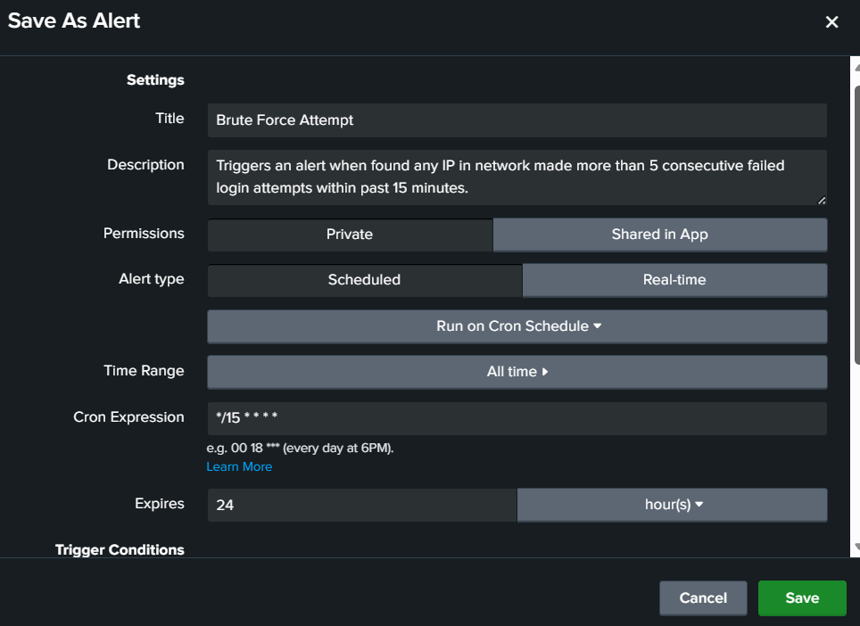
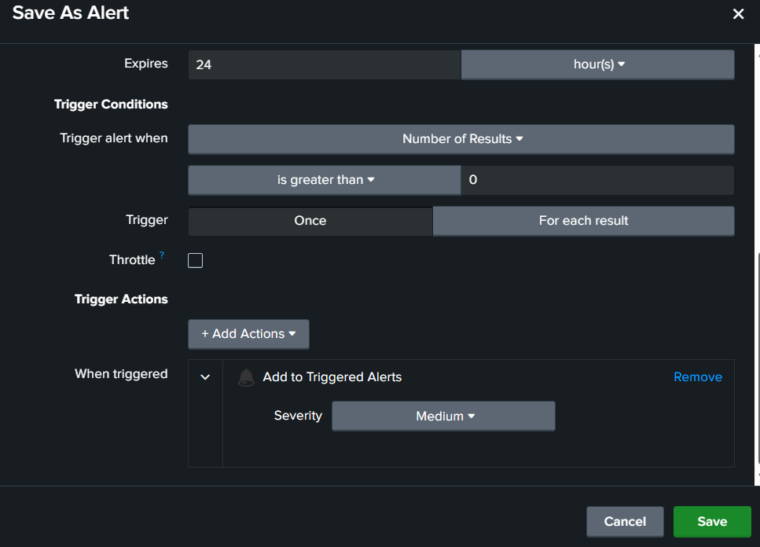
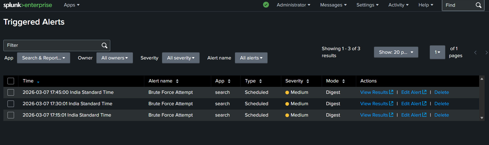
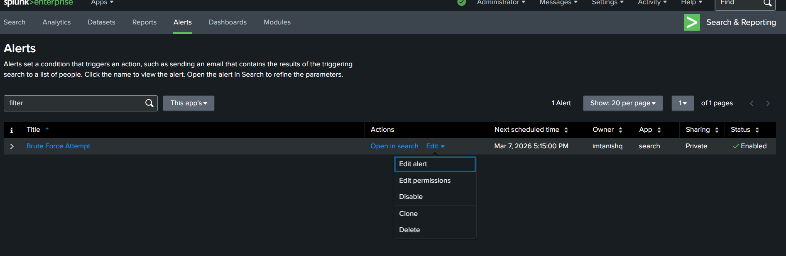
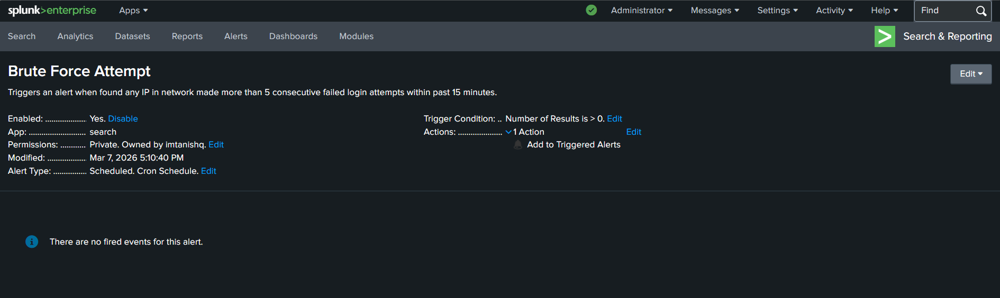

# Task 3 — Brute-Force Detection & Automated Alert

## 🎯 Objective
Detect IPs making repeated failed authentication attempts and configure a Splunk alert that automatically fires when any IP crosses 5 failed attempts.

---

## 🔍 SPL Query

```spl
source="ssh_logs.json" host="LAPTOP-Tanishq" sourcetype="_json"
event_type="Multiple Failed Authentication Attempts"
| stats count by id.orig_h, id.resp_h
| where count > 5
```

---

## 📊 Results

- **Total brute-force events:** 909
- **Unique attacker-target pairs above threshold:** 58
- **Top attacker:** `10.0.0.28 → 10.0.1.1` with 15 attempts

---

## 🔔 Alert Configuration

From the query results: **Save As → Alert**

| Setting | Value |
|---------|-------|
| Title | Brute Force Attempt |
| Alert Type | Scheduled |
| Cron Expression | `*/15 * * * *` |
| Time Range | All Time ⚠️ |
| Trigger When | Number of Results > 0 |
| Trigger | For each result |
| Severity | Medium |
| Action | Add to Triggered Alerts |

---

## ⚠️ Why "All Time" Instead of "Last 15 Minutes"

In **production**, the correct setting is `Last 15 minutes` paired with cron `*/15 * * * *` — window equals schedule frequency, zero detection gaps, answers: *"Is someone attacking right now?"*

This project uses a **static log file with fixed 2025 timestamps**. When Splunk runs "Last 15 minutes" in 2026, those old timestamps fall outside the window and the alert never fires. Setting **All Time** ensures Splunk finds the static data and proves the detection logic works correctly.

```
Production:    */15 cron  +  Last 15 min  →  real-time detection ✅
This project:  */15 cron  +  All Time     →  fires on static data (expected) ⚠️
```

---

## 🖼️ Screenshots

### `Task_3-Detect_Multiple_Failed_Authentication_Attempts__Brute_Force_.png`
.png)

Statistics tab showing 909 events, 58 attacker-target pairs above threshold. **Save As dropdown** is open showing the Alert option — this is where alert creation begins.

---

### `Task_3-Creating_Alert_-1_.png`


Alert dialog (upper half) — Title, Description, Scheduled type, Cron `*/15 * * * *`, Time Range set to **All Time**, Expires 24 hours.


---

### `Task_3-Creating_alert-3.png`


Alert dialog (lower half) — Trigger condition: Number of Results > 0, Trigger mode: **For each result** (fires per offending IP, not just once), Severity: Medium, Action: Add to Triggered Alerts.

---


### `Task_3-Trigger_alert_panel.png`


Alerts list page — "Brute Force Attempt" is **Enabled**, next scheduled run shown as Mar 7, 2026 5:15:00 PM, confirming the cron is active.

---

### `Task_3-Updating_alerts.png`


Alert detail view — shows Enabled, Scheduled Cron type, Trigger Condition, and Action configured. The "no fired events" message here is expected — this screenshot was taken before the first cron run completed.

---

### `Task_3-Viewing_alert.png`


**Activity → Triggered Alerts** — alert fired **3 times** at exact 15-minute intervals:
- 17:15:01 IST
- 17:30:01 IST
- 17:45:00 IST

This confirms the cron schedule, threshold detection, and end-to-end alert pipeline all work correctly.
