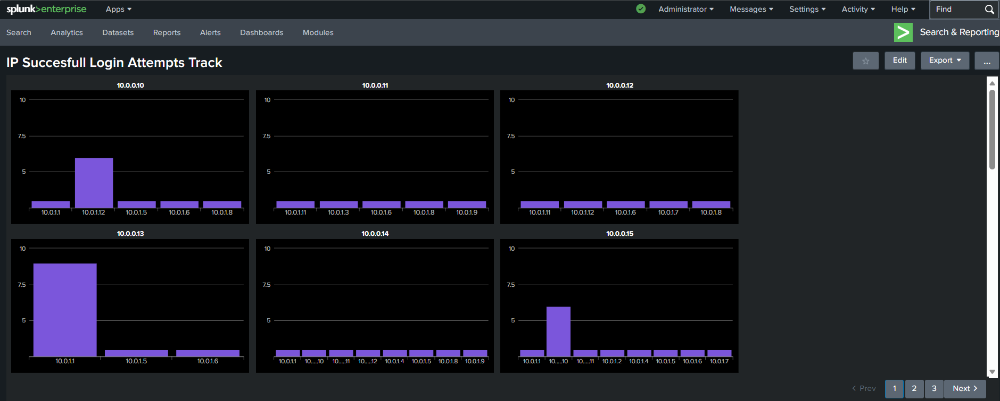
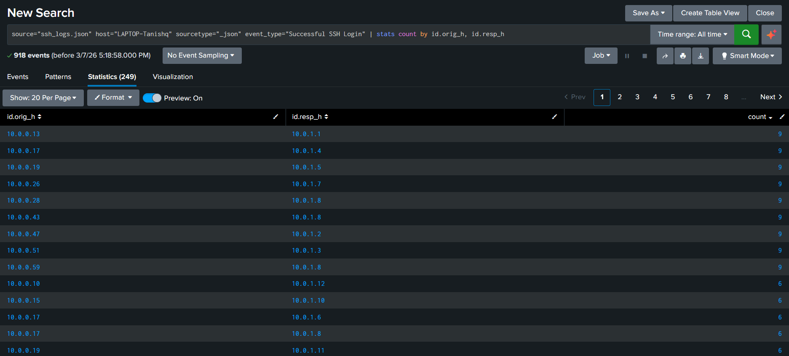
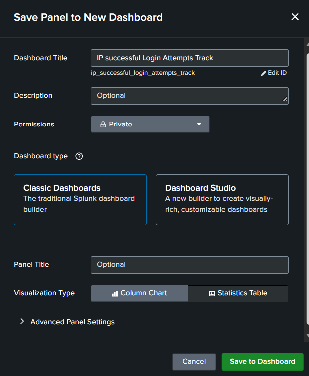

# Task 4 — Successful Login Tracking & Dashboard

## 🎯 Objective
Identify all successful SSH logins per source IP and create a dashboard panel for monitoring.

---

## 🔍 SPL Query

```spl
source="ssh_logs.json" host="LAPTOP-Tanishq" sourcetype="_json"
event_type="Successful SSH Login"
| stats count by id.orig_h, id.resp_h
```

---

## 📊 Results

- **Total successful login events:** 918
- **Dashboard created:** "IP Successful Login Attempts Track" — 3-page multi-panel bar chart

> **Security Insight:** Any IP appearing in both failed logins (Task 2) and successful logins is a high-priority IOC — indicates a potentially successful brute-force compromise. Cross-referencing both datasets enables **compromised account detection**.

---

## 🖼️ Screenshots

### `Task_4-Dashboard_for_Sucessfull_Login_count.png`


"IP Successful Login Attempts Track" dashboard — 6 panels visible (page 1 of 3), each showing successful login counts per destination host for a given source IP. `10.0.0.13` and `10.0.0.14` are the most active, with `10.0.0.14` connecting to many different destination hosts — a possible lateral movement indicator.

---

### `Task_4-Count_of_Connections_with_succesfull_authentication.png`


Stats which pairs of source and destination IP have most successfull count of authentication attempts.

---

### `Task_4-How_to_create_a_classic_dashboard_in_Splunk.png`


"First Run the SPL query to View Desired result of Successfull Login of IPs", then go to Saves As --> Then click on create New Dashboard (Here we have used 'Trellis Layout' for individual IP dashboard as shown above)

---


"Save Panel to New Dashboard" dialog — Dashboard Title, Classic Dashboard type selected, Column Chart visualization, Private permissions.
