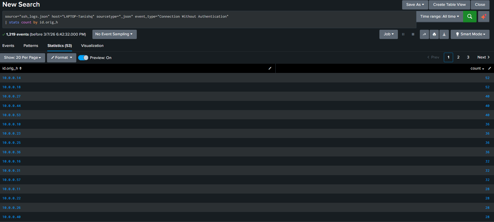
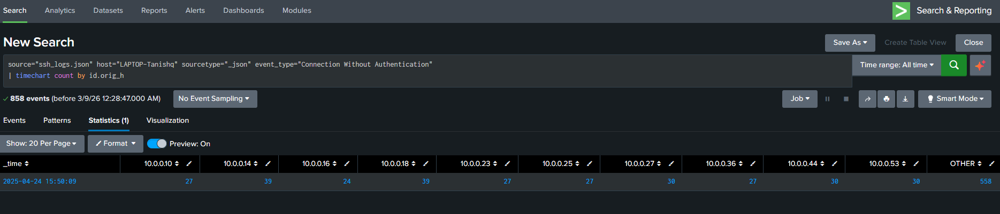

# Task 5 — Unauthenticated Connection Detection

## 🎯 Objective
Identify SSH connections where no authentication was ever attempted — a key indicator of port scanning or reconnaissance activity.

---

## 🔍 SPL Queries

```spl
# Count by source IP
source="ssh_logs.json" host="LAPTOP-Tanishq" sourcetype="_json"
event_type="Connection Without Authentication"
| stats count by id.orig_h

# Timechart over time
source="ssh_logs.json" host="LAPTOP-Tanishq" sourcetype="_json"
event_type="Connection Without Authentication"
| timechart count by id.orig_h
```

---

## 📊 Results

- **Total unauthenticated events:** 858
- **Unique source IPs:** 49
- **Top probing IPs:** `10.0.0.14` and `10.0.0.18` — 39 attempts each

### 🚨 13-Millisecond Attack Window

```spl
... event_type="Connection Without Authentication"
| stats earliest(_time) as first_seen, latest(_time) as last_seen, count
```

| first_seen | last_seen | count |
|------------|-----------|-------|
| 1745490009.508916 | 1745490009.521939 | 858 |

**Difference = 0.013 seconds = 13 milliseconds**

858 connections in 13ms is impossible for a human — conclusive evidence of **automated scanning tooling** (Nmap/Masscan-style).

.png)

---

## 🖼️ Screenshots

### `Task_5-Connections_without_authentication.png`


Statistics table — 858 events, 49 unique source IPs. Top IPs at 39 attempts each. These IPs connected to port 22 (all connections in an SSH log are on port 22) but never attempted credentials — classic port scan behaviour.

---

### `Task_5-Timechart_of_connections_without_authentication.png`


Timechart output — single time bucket at `2025-04-24 15:50:09` 
containing all 858 events. Every IP fired its probes within this 
one-second window, confirming a simultaneous automated scan burst 
rather than gradual human activity.
